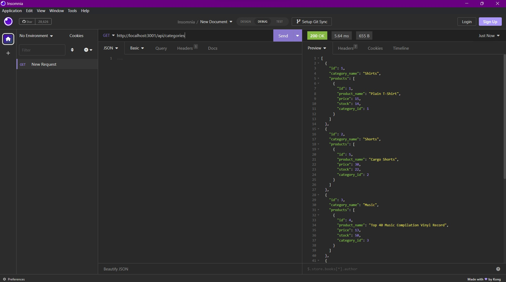

# ORM-Ecommerce-Back-End

## Description

This is a mysql application for the backend of an e-commerce site. The motivation behind this application was to further develop my skills with working in mysql, and sequelize to build an interactive backend for an e-commerce site.

## Walk Through Video

## Table of Contents

- [Installation](#installation)
- [Usage](#usage)
- [Credits](#credits)
- [License](#license)

## Installation

To install the application the user will need to run the following commands:
 `npm i`
 `npm i mysql2`
 `npm i sequelize`
 `npm i express`
 `npm run seed`
 `npm start`
 
These will install the dependencies needed to run the application.

## Usage

To start using the program the user will need to first seed the database, then start the program using the following commands:

"npm seed"
"npm start"

The user is then able to use the application and use different routes to get different data or information.

`http://localhost:3001/api`

The user is then able to use the following to access further routes.
`/categories`
`/tags`
`/products`

by tacking on the end of the another `/` and adding a number they are also able to retrieve and edit data depending on their request type sent.

## Credits

Starter Code Repo:
https://github.com/coding-boot-camp/fantastic-umbrella

Starter Code Contributor:
Xandromus:  https://github.com/Xandromus

## License

This project has an MIT License
